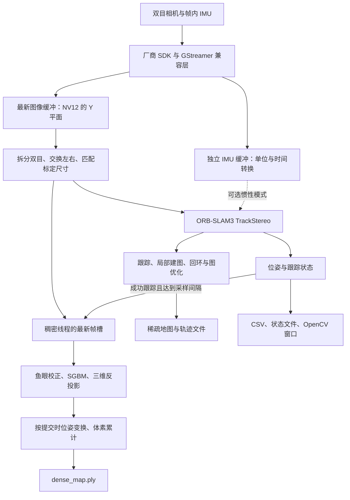

# 视觉 SLAM 项目理解与进展报告

版本：v2.0 · 更新日期：2026-09-12
分析基线：`0e229dedadcba0666a012fc3d5ebe94b9a1a4376`
项目：[garand-spec/visual_slam](https://github.com/garand-spec/visual_slam)
设备目录：`/home/linaro/projects/visual_slam`

## 1. 项目定位与当前结论

项目已从原来的 `yxt_visual_slam` 光流演示发展为面向 **NVIDIA Jetson AGX Thor + RERVISION 双目鱼眼相机** 的视觉定位与点云建图工程。主程序以 ORB-SLAM3 完成双目稀疏定位，在独立线程中使用鱼眼校正、SGBM 立体匹配和体素累计生成灰度稠密点云。

当前具备实时采集、双目跟踪、状态显示、后台启停和地图导出的完整代码路径；设备保留的运行结果也证明至少在有限场景下完成过采集到导出的流程。**现有证据支持“可运行的工程原型”，尚不足以证明长期稳定性、定位精度或全局一致的稠密重建。**

本次工作包括源码与配置阅读、第三方补丁审查、已有运行记录统计、Python 测试和结果校验。未启动相机重新采集，未重新编译 C++ 或第三方依赖，未进行带真值的轨迹精度评估。运行目录没有记录代码提交与完整启动参数，因此不能将历史结果严格归属于本次分析基线。

## 2. 系统结构



相机图像缓冲和稠密任务均采用“只保留最新一帧”的策略，处理不及时会丢弃旧图像或旧任务，以限制队列等待。IMU 样本独立积累，避免直接随丢帧一起丢弃。该设计偏重及时响应，不保证处理每一帧输入。

| 模块 | 入口 | 实现职责与边界 |
| --- | --- | --- |
| 实时适配器 | [src/orbslam3_rervision.cpp](../src/orbslam3_rervision.cpp) | 相机回调、双目预处理、IMU 缓冲、SLAM 调用、稠密线程、诊断与导出 |
| 稀疏 SLAM | [vendor/patches/ORB_SLAM3.patch](../vendor/patches/ORB_SLAM3.patch) | CUDA ORB、部分鱼眼/显示适配及地图访问接口；核心 SLAM 来自上游 |
| 相机兼容层 | [gst_compat.c](../vendor/rervision_single_imu/native/gst_compat.c) | 替换 SDK 内的解码管线，限制缓冲并返回主机可读图像 |
| 离线回放 | [src/orbslam3_stereo_dataset.cpp](../src/orbslam3_stereo_dataset.cpp) | 读取双目图片和时间戳，执行纯双目 SLAM；没有实时适配器中的稠密线程 |
| 数据准备 | [tools/prepare_stereo_dataset.py](../tools/prepare_stereo_dataset.py) | 拼接视频拆分、可选左右交换、抽帧、时间戳及数据清单生成 |
| 标定 | [src/calibrate_fisheye.py](../src/calibrate_fisheye.py)、`configs/` | 鱼眼棋盘格标定与本机参数；更换相机需重新标定 |
| 运维和验收 | 根目录启停脚本、[tools/validate_project.py](../tools/validate_project.py) | 进程管理、项目资产校验、实时运行结果的基础检查 |

## 3. 输入、标定与默认配置

默认启动链为 `run_visual_slam_3d.sh` → `run_orbslam3_rervision.sh` → `bin/orbslam3_rervision`。脚本设置动态库和兼容库路径，默认选择 `jpegdec`；兼容层随后使用 `nvvidconv` 转换。当前路径不应描述为全程 GPU 解码。

### 3.1 双目与稀疏定位

| 项目 | 当前配置或实现 |
| --- | --- |
| 相机图像 | 工程按 3840×1200 拼接图处理，两目各 1920×1200；本次未重新枚举相机 |
| 默认眼序 | 原始第二半幅为 LEFT/Camera1，同时选择 `swapped.yaml` |
| 投影模型 | YAML 为 `KannalaBrandt8`；标定工具采用 OpenCV fisheye |
| 稀疏处理尺寸 | `Camera.newWidth/newHeight = 960×600` |
| ORB 特征配置 | 1200 特征、8 层金字塔、尺度因子 1.2 |
| 相机 FPS 参数 | YAML 为 60；这是配置值，不代表实际处理帧率 |
| 双目基线 | 约 0.1077 m，从配置外参平移向量计算 |

JSON 标定记录使用 21 组图像，拒绝 9 组；棋盘内角点排列为 `[11, 8]`，方格边长为 0.025 m。记录的重投影 RMS 为左目 0.249 px、右目 0.299 px、双目 0.676 px。这些是标定拟合指标，不是 SLAM 定位误差。

### 3.2 稠密融合

默认每累计 6 个成功跟踪帧提交一次深度任务，校正尺寸为 640×400，采样步长为 2 像素，体素边长为 0.05 m，有效相机深度为 0.3～12 m。SGBM 使用 128 个视差范围、5 像素窗口和 `MODE_SGBM_3WAY`，视差起点根据校正基线符号选择。

代码保留 `stereoRectify` 的旋转，但重新设置约 90° 视场的投影矩阵，以处理现有鱼眼拟合产生的极小校正焦距。需要通过实测距离和校正后极线残差继续核验这一路径的几何精度。

深度点经校正旋转的逆变换回到左相机坐标，再使用 `Tcw.inverse()` 变换到地图坐标。每个体素累计坐标、灰度和样本数，导出均值。体素数上限为 2,000,000；达到上限后不再插入新体素。实现中没有 TSDF、网格提取、纹理贴图或动态物体分割。

### 3.3 IMU

`--imu` 会选择 `IMU_STEREO`，读取每帧附带的 11 组惯性样本；加速度和角速度转换为 SI 单位，微秒时间戳转换为秒。样本提取使用前一相机时刻至当前时刻附近的窗口，并额外包含当前时刻后 5 ms。

当前 `IMU.T_b_c1` 仍为单位阵占位值；600 Hz 与噪声参数是配置值，尚无本次实测依据。两个保留运行的 `imu_samples` 总数均为 0，不能用于证明惯性融合效果。正式使用前需验证相机—IMU 外参、轴向、时间偏移、样本单调性和噪声参数。

## 4. GPU 与第三方依赖

CUDA 加速集中在 ORB 特征提取：左右目提取器分别持有 CUDA Stream、GpuMat 和描述子缓冲；失败时可回退 CPU。SGBM、地图管理和主要优化计算仍在 CPU 路径。没有证据表明本项目已经完成全流程 GPU 化。

| 依赖 | 固定上游提交 | 保存的定制内容 |
| --- | --- | --- |
| ORB-SLAM3 | `4452a3c4ab75b1cde34e5505a36ec3f9edcdc4c4` | CUDA ORB、鱼眼相关适配、地图查询、显示与构建修改 |
| OpenCV | `49486f61fb25722cbcf586b7f4320921d46fb38e` | CUDA 设备属性查询兼容修改 |
| opencv_contrib | `d943e1d61c8bc556a13783e1546ee7c1a9e0b1cf` | cudev tuple 命名空间兼容修改 |

依赖通过子模块固定版本，本机改动保存为 `vendor/patches/`，具体步骤见 [vendor/README.md](../vendor/README.md)。父仓库配置了 `ignore = dirty`，因此父仓库状态干净不等于第三方工作区没有修改；修改依赖后必须同步更新补丁。

仓库包含相机 ARM64 SDK 动态库，但不包含 ORB/OpenCV 的完整编译产物或 Conda 环境。首次克隆需要拉取子模块、应用补丁并构建依赖。当前构建脚本面向已配置的 Jetson，不是一条命令即可复现全部环境的安装器。本次核查时存在实时二进制，未发现 `bin/orbslam3_stereo_dataset`；离线源码存在不等于已完成离线部署验收。

## 5. 已有运行记录与本次验证

以下数值从设备保留的 CSV 和 PLY 文件重新统计；原始文件保留在设备 `data/runtime/orbslam3/`，不上传采集数据。汇总、原始文件 SHA-256 和计算规则见 [运行核查数据](运行核查_20260912.json)。

| 指标 | `run_20260831_151502` | `run_20260912_192042` |
| --- | ---: | ---: |
| 处理帧数 | 1191 | 660 |
| 成功跟踪帧数 | 857 | 660 |
| 成功跟踪比例 | 71.96% | 100.00% |
| 首末相机时间戳跨度 | 40.917 s | 30.027 s |
| 按相机时间戳计算的处理采样率 | 29.08 帧/s | 21.95 帧/s |
| `TrackStereo` 平均耗时 | 19.726 ms | 43.964 ms |
| 耗时中位数 / P95 | 18.617 / 31.748 ms | 41.450 / 63.506 ms |
| 最大连续丢失帧数 | 92 | 0 |
| 导出稀疏点数 | 16 | 432 |
| 导出稠密点数 | 483139 | 367276 |
| 传入 SLAM 的 IMU 样本总数 | 0 | 0 |

成功状态按 `OK`、`OK_KLT` 统计；采样率采用 `(N−1)/(末时间戳−首时间戳)`；P95 采用排序后的 nearest-rank 定义。`track_ms` 仅覆盖 `TrackStereo` 调用，不含完整采集、图像预处理、显示与导出耗时，不能简单取倒数当作端到端帧率。

两次记录的场景、运动、启动参数、显示模式与功耗配置未完整留存，因此不能据此断言性能回退或算法改善。旧记录点云更多但跟踪成功率更低，也说明点数本身不能代表建图质量。历史文档中的 2 FPS、21 FPS、30 FPS 以及 16～19 ms 属于不同口径的旧观测，不应作为统一性能承诺；本次未核实当前功耗模式或锁频状态。

本次重新执行的验证：

- `python -m unittest discover -s tests -v`：5/5 通过，覆盖左右拆分与交换、奇数宽度裁剪、视频转换、项目资产及 PLY 头读取。
- `python tools/validate_project.py --latest`：27/27 检查通过，最新记录有 660 行有限位姿、432 个稀疏点和 367276 个稠密点。
- 两份保留健康记录的相机时间戳均严格递增。

上述验收是文件、数值和基本跟踪状态检查，不包含 ATE/RPE、闭环成功率、尺度误差、点云表面误差或长期稳定性。校验器把稠密 PLY 视为可选，PLY 检查只读取声明的顶点数；不能据此认为所有稠密结果都经过几何验证。

## 6. 输出语义与使用注意

| 输出 | 实际含义 |
| --- | --- |
| `poses.csv` | 直接记录当帧 `TrackStereo` 返回的 `Tcw`，即世界到相机的变换；时间单位为秒，包含非成功状态行 |
| `tracking_health.csv` | 实时模式的逐帧状态、特征数、IMU 数及 `TrackStereo` 耗时 |
| `status.txt` | 每 15 帧左右刷新的一次快照，不是最终完整统计；不能代替最终 PLY 点数 |
| `map.ply` | 当前活动地图中经过坏点、观测数和匹配比例过滤的稀疏点 |
| `dense_map.ply` | 按历史提交时位姿累计的灰度体素均值点云 |
| `CameraTrajectory.txt` | 上游 `SaveTrajectoryEuRoC` 导出的轨迹，使用纳秒时间戳，成功定位帧按参考关键帧重建；纯视觉模式输出相机到世界的位姿，并调整参考原点 |
| `KeyFrameTrajectory.txt` | ORB-SLAM3 的关键帧轨迹；需按实际模式和参考地图解释 |
| 离线 `summary.txt` | 离线帧数、成功比例、导出稀疏点数和总耗时 |

`poses.csv` 的平移不是可直接绘制的世界坐标相机中心；需要对整个 SE(3) 取逆。它也不能与最终导出轨迹逐行直接比较：变换方向、时间单位、后端优化和地图选择均可能不同。当前导出轨迹采用“纳秒时间戳 + tx ty tz qx qy qz qw”的空格分隔布局；接入评估工具前应明确转换格式，不应仅凭文件名假定是标准秒制 TUM 输入。

`Atlas::GetAllMapPoints()` 在当前上游实现中返回活动地图的点，而轨迹导出会选择关键帧最多的地图。发生地图重建或切换时，两种产物未必对应同一张地图。

## 7. 主要缺口与后续优先级

以下为源码核查得出的限制及建议，本次仅更新报告，没有修改运行算法。

| 优先级 | 发现与影响 | 建议与验收方法 |
| --- | --- | --- |
| P1 | 稠密帧只保存提交时的 `Tcw`，体素中不保留关键帧归属；没有闭环后重新融合路径。回环修正后可能出现重影或稀疏/稠密错位 | 保存关键帧深度和相对位姿，按优化后位姿重建或调整子地图；用闭环路线检查表面对齐 |
| P1 | 稠密线程不记录 map ID，也不响应 Atlas 重建或切换，可能把不同坐标系的点混入一个体素表 | 至少按 map ID 分段或清空；后续再做跨图融合。用主动遮挡、丢失和恢复场景验证 |
| P1 | IMU 外参为占位值，缺少惯性模式的实测验证 | 完成时空与噪声标定，再用带真值序列比较纯视觉与惯性模式 |
| P1 | 轨迹、稀疏地图、稠密点云的参考地图和变换语义未统一记录 | 输出 manifest，记录 map ID、坐标方向、时间单位、模式与优化状态；增加跨输出一致性验收 |
| P2 | 离线程序不产生 `tracking_health.csv`，但 `validate_run()` 将其视为必需，因此直接验收离线目录会失败 | 按实时/离线模式区分输出契约，或统一健康字段；用一次真实离线运行验证 |
| P2 | 实时退出码主要取决于是否处理过帧；处理过帧后发生异常也可能返回 0。稠密初始化失败可继续稀疏运行 | 明确异常和导出失败的退出码；验收器检查最终完成状态及必需输出 |
| P2 | `stop_slam.sh` 根据进程退出打印“已导出”，没有读取产物核实 | 停机后检查完成标记和文件；覆盖正常中断、初始化失败与写盘失败 |
| P2 | `System.h` 中新增地图 ID、版本和重置查询等声明，但未找到相应 `System.cc` 定义，实时主程序也没有调用 | 补齐实现和调用后再标记为“支持地图事件”；当前不能把接口声明当成功能完成 |
| P2 | 缺少每次运行的提交号、依赖补丁哈希、参数、场景和功耗信息 | 自动保存运行 manifest，建立可比较的固定路线与参数矩阵 |
| P2 | 构建依赖仍依赖设备现有环境，离线二进制尚未发现 | 增加可复现环境清单与依赖构建说明，在干净目录完成一次构建和离线回放 |

离线输入按文件名排序配对，只检查左右数量和图片有效性；显式提供但读不到有效内容的时间戳文件会回退固定 FPS。时间戳严格单调、同名左右配对和标定尺寸一致等条件应作为后续输入校验重点。

## 8. 下一阶段验证计划

1. **统一运行证据**：每次采集保存提交、配置哈希、启动参数、SDK/依赖版本、显示模式、功耗模式和退出结果。保留同一条固定路线的图像或视频以便回放。
2. **保证坐标一致**：先记录活动 map ID 并隔离不同地图的稠密结果，再实现回环后的稠密重建。验收轨迹与两类 PLY 是否使用同一地图和原点。
3. **完善离线回归**：构建数据集运行器，统一输出与校验契约；增加时间戳错误、左右不匹配、无有效跟踪和导出失败的验证。
4. **量化性能与精度**：在相同输入和参数下比较稠密开关、显示模式、分辨率与特征数，分别统计处理采样率、跟踪耗时 P50/P95、成功率、丢失次数和内存。另用真值轨迹/已知距离测量 ATE、RPE 和尺度误差。
5. **最后评估 IMU 收益**：完成标定后再运行相同路线，衡量快速运动、弱纹理与短时遮挡下的改善，避免以“能启动”代替融合有效性验证。

## 9. 复核入口

在设备已配置环境中执行：

```bash
cd /home/linaro/projects/visual_slam
/home/linaro/miniconda3/envs/fire-monitor/bin/python -m unittest discover -s tests -v
/home/linaro/miniconda3/envs/fire-monitor/bin/python tools/validate_project.py --latest
git status --short --branch
```

统计数据来源、口径与原始文件哈希见 [运行核查_20260912.json](运行核查_20260912.json)。操作说明见 [README_SLAM.md](../README_SLAM.md)，快速启动见 [README.md](../README.md)。


## 2026-09-12 补充：三维运动可视化

新增浏览器三维回放和实时查看层，实时 CSV 增加地图与连续片段编号，并输出约 10 Hz 的相机到世界位姿快照。观看层按失效或地图变化断开轨迹，并拒绝把零地图支持的初始化原点视为可信位置。此修改只解决观测与部分数据语义问题，没有实现稠密回环重建或修复双目定位。新一轮现场检查出现频繁初始化、丢失和零点地图，不能据历史成功记录承诺当前行走定位可用。功能、限制与新验证记录见 [三维轨迹可视化](三维轨迹可视化.md)。
